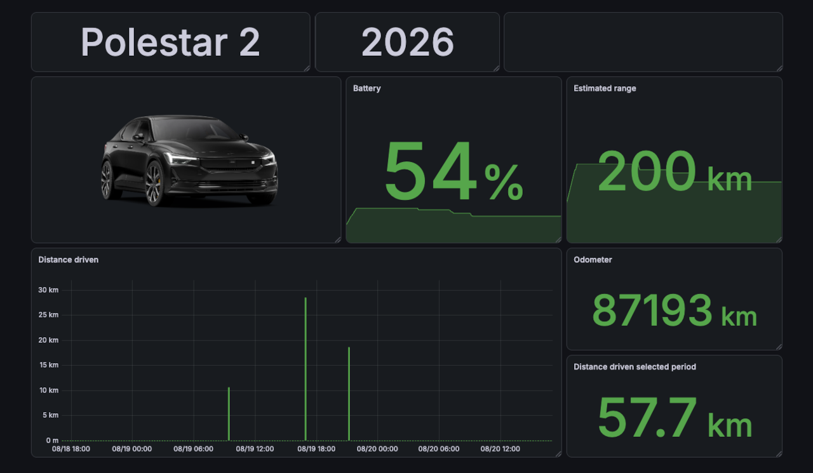

# Polestar exporter

Monitor your Polestar with Prometheus and Grafana.



## Description

This Prometheus exporter connects to Polestar APIs and makes data available as Prometheus metrics.

Polestar has no public and documented API, but there are several integrations that use the same services as the Polestar app and website. This exporter is based on information and code from [evcc-io/evcc](https://github.com/evcc-io/evcc) and [pypolestar/pypolestar](https://github.com/pypolestar/pypolestar).

Since there is no public API, breaking changes can happen without warning, and an updated version of polestar-exporter may not be available immediately.

## Running

A Docker image is available on [ghcr.io](https://github.com/terjesannum/polestar-exporter/pkgs/container/polestar-exporter).  
Prebuilt binaries for Linux, MacOS and Windows are available on the [release page](https://github.com/terjesannum/polestar-exporter/releases/latest).

Your Polestar account is used to query the data, so credentials must be given at startup:

| Command line option | Environment variable | Default value |
|---------------------|----------------------|---------------|
| `-username`         | `POLESTAR_USERNAME`  |               |
| `-password`         | `POLESTAR_PASSWORD`  |               |
| `-listen-address`   |                      | `:8080`       |
| `-static-only`      |                      | `false`       |

Use `-static-only` if you only need car info and images, no telemetry.

### Docker container

```sh
docker run -d -p 8080:8080 -e POLESTAR_USERNAME=... -e POLESTAR_PASSWORD=... --restart unless-stopped ghcr.io/terjesannum/polestar-exporter:latest
```

### Binary

Set your Polestar credentials in the `POLESTAR_USERNAME` and `POLESTAR_PASSWORD` environment variables:

```sh
polestar-exporter
```

Or pass them as flags:

```sh
polestar-exporter -username ... -password ...
```

## Prometheus

Prometheus needs to be configured to scrape the exporter, so add a scrape job in `/etc/prometheus/prometheus.yml`:

```yaml
scrape_configs:
  - job_name: "polestar-exporter"
    scrape_interval: 1m
    static_configs:
      - targets: ["localhost:8080"]
```

## Grafana

Import the [dashboard](grafana/dashboard.json) and select the Prometheus datasource that scrapes the exporter.

For a complete docker-compose setup of Grafana, Prometheus and this exporter, look at the example from [terjesannum/tibber-exporter](https://github.com/terjesannum/tibber-exporter/tree/master/docker-compose). Only minor changes are needed to run this exporter instead.

## Metrics

| Name                                        | Description                                                 |
|---------------------------------------------|-------------------------------------------------------------|
| `polestar_battery_distance_to_empty_meters` | Estimated distance to empty in meters                       |
| `polestar_battery_level_percent`            | Battery charge level in percent                             |
| `polestar_battery_timestamp_seconds`        | Timestamp of the battery data                               |
| `polestar_charging`                         | Charging status of the car (1 = charging, 0 = not charging) |
| `polestar_charging_time_to_full_seconds`    | Estimated time to full charge in seconds                    |
| `polestar_exporter_build_info`              | Polestar exporter build info                                |
| `polestar_health_timestamp_seconds`         | Timestamp of the health data                                |
| `polestar_image`                            | Car image                                                   |
| `polestar_info`                             | Information about the car                                   |
| `polestar_odometer_meters_total`            | Odometer reading in meters                                  |
| `polestar_odometer_timestamp_seconds`       | Timestamp of the odometer data                              |
| `polestar_service_remaining_meters`         | Distance in meters until the next required service          |
| `polestar_service_remaining_seconds`        | Number of seconds until the next required service           |

Data is fetched every minute, but is not necessarily updated that often. The odometer reading seems to update only when the car is parked.
